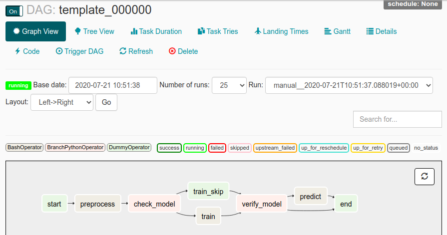

template
-----

This template can be used to productionize a *Machine/Deep learning* algorithm (with a few adjustments).

```main.py``` contains **tasks** to be run: some tasks can be run locally (*e.g.* for developement purpose) or on the cloud (this template uses GCP AI platform).

There is a sample DAG ```dag.py``` that can be used on an Airflow - production - cluster (\*Airflow is an orchestrator).



After cloning this repo, you should create a python3 venv (named *venv* at the repo's root) and install all 3 requirements file:

  - *requirements* contains modules needed by our main.py and custom model **except** tensorflow ;

  - *requirements-ml* contains our custom library (not available on PyPI) that will be needed by GCP AI platform (will be uploaded to Google Storage when needed) ;

  - *requirement-extra* contains the same tensorflow version that will be used on AI platform (depending on the runtime environment and installed by default).

There is a **MyModel** class containing *preprocess*, *train* and *predict* methods skeletons.

```template.yaml.template``` is the configuration file template containing (mainly) credentials.

```queries.yaml``` contains templated queries to be used to access or get data from any database (BigQuery in this case).

**mymodel** is our custom library .

### PACKAGING DAG AIRFLOW AND CODE

```build``` folder contains code to make debian packages for DAG and CODE alongside files for jenkins pipelines.

**DAG**: make-dag-package.sh

  * version number
  > hard coded

  * path
  >/opt/airflow/dags/

**CODE**: make-code-package.sh

  * version number
  > hard coded

  * path
  > /opt/
